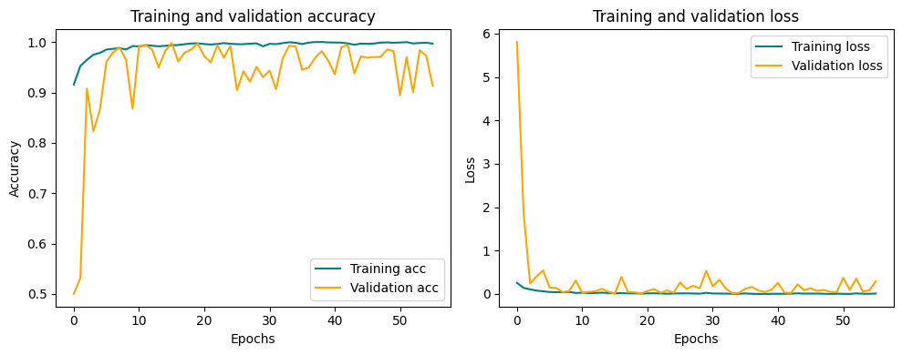

# Drowsy Driver Detection System

## Overview
This project implements a real-time drowsy driver detection system using computer vision and deep learning. The system monitors drivers through a webcam and alerts them when signs of drowsiness are detected, helping prevent accidents caused by fatigue while driving.

### Key Features
- Real-time face detection and tracking
- Eye state monitoring (open/closed)
- Yawning detection
- Multiple alert scenarios
- Works in various lighting conditions
- Support for non-frontal face angles

## Dataset
The drowsiness detection system is trained using the **Drowsiness Detection Dataset** from Kaggle ([link](https://www.kaggle.com/datasets/hoangtung719/drowsiness-dataset)). This dataset includes images of open/closed eyes and yawning/non-yawning mouths. It consists of **11,566 images** divided into train, validation, and test sets.

## Model Architecture and Performance

### Eye State Detection Model (Version 6.3)
The eye state detection model is trained to classify eyes as either open or closed.

#### Training Results

*Figure 1: Training and validation accuracy/loss curves for eye detection model*


*Figure 2: Confusion matrix showing eye detection model performance*

### Mouth State Detection Model (Version 6.3)
The mouth state detection model is trained to detect yawning.

#### Training Results

*Figure 3: Training and validation accuracy/loss curves for mouth detection model*


*Figure 4: Confusion matrix showing mouth detection model performance*

## Installation

### Prerequisites
- Python 3.8 or higher
- Webcam

### Setup
1. Clone the repository:
```bash
git clone https://github.com/hoangtung386/Drowsy-Driver-Detection-System.git
cd Drowsy-Driver-Detection-System
```

2. Install required packages:
```bash
pip install -r requirements.txt
```

3. **Download Required Model Files:**
    - Download the following model files from [this Google Drive link](https://drive.google.com/drive/folders/1gsN7ZrrrcjxTNn6BnZaLG-UdtJym7Dz1?usp=sharing):
        - `simple_CNN_eye_modelV6_3.keras`
        - `simple_CNN_mouth_modelV6_3.keras`
    - After downloading, create a folder named `Model` inside the `Drowsy-Driver-Detection-System` directory. Move both model files (`.keras` files) into the `Model` directory.
    
4. The face landmark predictor has been preloaded and placed in the Models folder:
   - `shape_predictor_68_face_landmarks.dat`

## Usage
**To run the detection script, please navigate to the `Source code` directory first:**
```bash
cd Source_code
python detection.py
```

### Alert Scenarios
1. **Yawning with Closed Eyes**
   - Triggers a 5-second alarm at 70% volume
   - Indicates severe drowsiness

2. **Prolonged Eye Closure**
   - Triggers when eyes remain closed for 3 seconds
   - Alarm at 100% volume until eyes reopen
   - Prevents microsleep episodes

3. **Face Not Visible/Not Forward-Facing**
   - Triggers alarm at 70% volume
   - Ensures driver maintains proper attention

## Experimental Results

### Real-time Detection Examples

*Figure 5: System detecting normal state*


*Figure 6: System detecting drowsiness*

### Live Demo
Check out our system in action:
[Video demo will update soon](https://drive.google.com/file/placeholder_link/view)

## Technical Details

### Image Preprocessing
- CLAHE (Contrast Limited Adaptive Histogram Equalization) for enhanced contrast
- Grayscale conversion
- Resolution standardization (128x128 for eyes, 256x256 for mouth)

### Face Detection
- Uses dlib's facial landmark detector
- 68 facial landmarks for precise feature localization
- Robust to various head poses and lighting conditions

### Performance Metrics
- Eye State Detection:
  - High accuracy in varying light conditions
  - Real-time processing capability
  - Robust to different eye shapes

- Mouth State Detection:
  - Accurate yawn detection
  - Low false positive rate
  - Handles partial occlusions

## Future Improvements
1. Integration with vehicle systems
2. Support for infrared cameras for nighttime operation
3. Driver attention scoring system
4. Machine learning model optimization for embedded systems
5. Multiple camera angle support
6. Cloud connectivity for fleet management

## License
This project is licensed under the MIT License - see the LICENSE file for details.

## Acknowledgments
- dlib community for facial landmark detection
- TensorFlow team for the deep learning framework
- OpenCV community for computer vision tools

## Contact
For any queries regarding this project, please contact:<br>
Email: levuhoangtung1542003@gmail.com